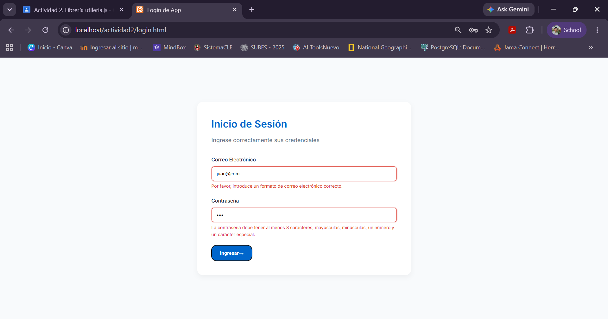

# Utilería JS: Librería de Validaciones Web

## 1. Portada
* **Autor:** Irving José Pérez Gris
* **Materia:** Programación web
* **Problema que resuelve:** Esta librería independiente resuelve el problema de la captura de datos erróneos o maliciosos en formularios web. Proporciona funciones puras para validar formatos de correo electrónico, contraseñas seguras, nombres con acentos, límites numéricos y cálculos exactos de edad. Al evitar el procesamiento de datos inválidos, mejora significativamente la seguridad y la experiencia del usuario (UX) mediante alertas dinámicas.

## 2. Instalación
Para utilizar esta librería en cualquier proyecto, incluye el archivo JavaScript justo antes del cierre de la etiqueta `</body>` en tu documento HTML:

```html
    <script src="js/utileria.js"></script>
```

## 3. Documentación y Uso de Funciones

A continuación, se muestra el uso de las funciones principales de la librería.

### Funciones de Login y Credenciales

**`validarCorreo(correo)`**

Valida que la cadena cumpla el formato estándar de un correo electrónico.

```javascript
let correoValido = validarCorreo("usuario@gmail.com"); // true
```

**`validarPassword(password)`**

Verifica que la contraseña contenga al menos 8 caracteres, mayúsculas, minúsculas, números y un carácter especial.

```javascript
let passSegura = validarPassword("Admin123$"); // true
```

### Funciones de Formato y Limpieza (Registro)

**`soloLetras(texto)`**

Asegura que el campo solo contenga letras (incluidos los acentos y la «ñ») y espacios.

```javascript
let nombreCorrecto = soloLetras("María Pérez"); // true
```

**`validarLongitud(numero, maxLongitud)`**

Valida que un número o una cadena de texto no exceda la longitud máxima permitida y no esté vacío.

```javascript
let longitudValida = validarLongitud("5512345678", 10); // true
```

**`esSoloNumeros(texto)`** *(Función Extra 1)*

Bloquea cualquier carácter que no sea un dígito numérico; es ideal para validar números telefónicos.

```javascript
let esTelefono = esSoloNumeros("5512345678"); // true
```

**`formatearNombre(nombre)`** *(Función Extra 2)*

Capitaliza automáticamente la primera letra de cada palabra de una cadena de texto.

```javascript
let nombreBonito = formatearNombre("juan perez"); // "Juan Perez"
```

### Funciones de Fechas y Cálculos

**`calcularEdad(fechaNacimiento)`**

Calcula la edad exacta en años, teniendo en cuenta el mes y el día actuales. Devuelve `-1` si la fecha es futura.

```javascript
let edad = calcularEdad("2000-05-15"); // Retorna edad en formato numérico
```

**`esMayorDeEdad(fechaNacimiento)`**

Valida si, a partir de una fecha de nacimiento, la persona tiene 18 años o más.

```javascript
let esMayor = esMayorDeEdad("2000-05-15"); // true
```

## 4. Capturas de Pantalla

**Validaciones en el inicio de sesión (bordes rojos y mensajes dinámicos):**


**Ventana modal de inicio de sesión**


**Validaciones en el formulario (bordes rojos y mensajes dinámicos)**


**Ventana modal de registro (cálculo de edad):**


## 5. Demo Promocional

**Enlace al video:** https://youtu.be/RBy706iTYnw


## 6. Enlaces del Proyecto

* **Repositorio del código:** https://github.com/IrvingJosePG/Utileria-JS.git
* **Proyecto en línea (GitHub Pages):** https://irvingjosepg.github.io/Utileria-JS/